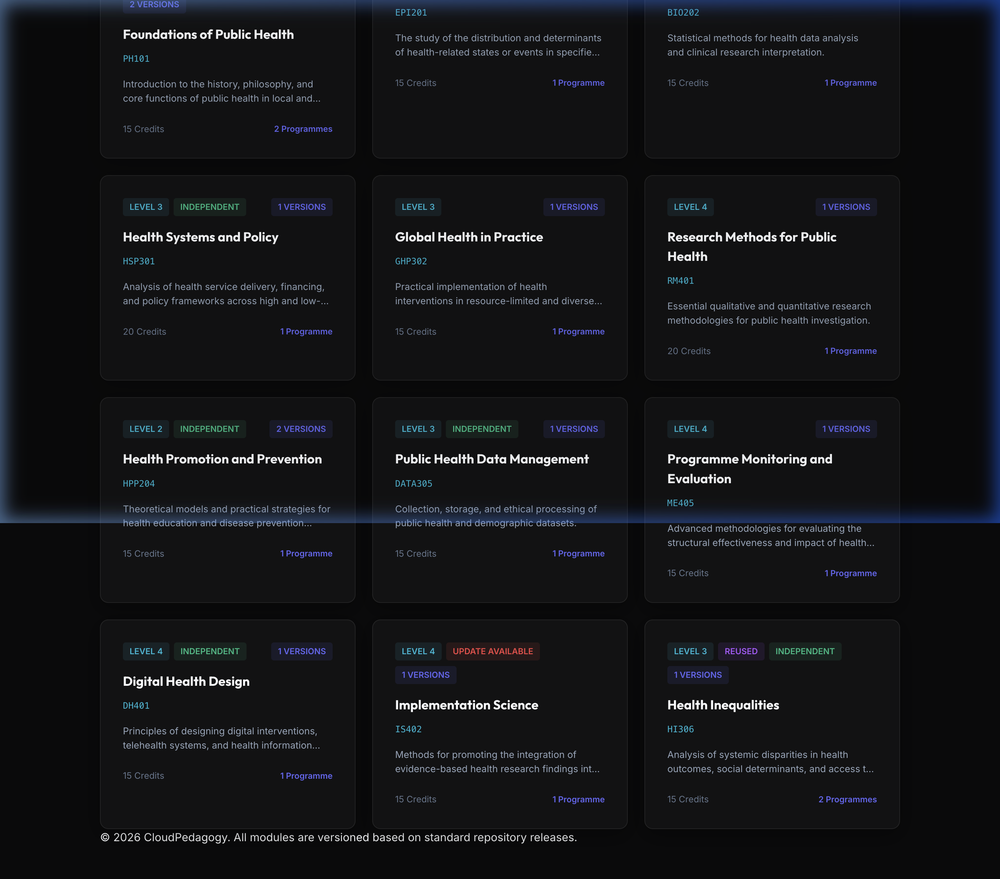

# Shared Module Repository System (SMRS)

The **Shared Module Repository System (SMRS)** is a structural registry for reusable curriculum assets. It provides academic users with a professional infrastructure to browse, inspect, and track versioned learning modules across diverse programmes.

---

🌐 **Live Hosted Version:**
[http://cloudpedagogy-shared-module-repository-system.s3-website.eu-west-2.amazonaws.com/](http://cloudpedagogy-shared-module-repository-system.s3-website.eu-west-2.amazonaws.com/)

---

🖼️ **Screenshot**

---

## 🚀 Core Features

-   **Registry Layer**: A centralized library for modular curriculum assets.
-   **Version Tracking**: Structural comparison of Learning Outcomes and Assessments across module releases.
-   **Dependency Mapping**: Visual visibility of module-to-module prerequisites and program-level reuse.
-   **Integrity Dashboard**: Real-time validation signals for broken version links and duplicate identifiers.

---

## 📖 Documentation

For a detailed guide on how to navigate the repository and use the inspection tools, please see the:
[Detailed User Instructions](USER_INSTRUCTIONS.md)

---

## 🛡️ Disclaimer
This repository contains exploratory, framework-aligned tools developed for reflection, learning, and discussion.

These tools are provided as-is and are not production systems, audits, or compliance instruments. Outputs are indicative only and should be interpreted in context using professional judgement.

All applications are designed to run locally in the browser. No user data is collected, stored, or transmitted.

All example data and structures are synthetic and do not represent any real institution, programme, or curriculum.

---

## 📜 Licensing & Scope
This repository contains open-source software released under the **MIT License**.

CloudPedagogy frameworks and related materials are licensed separately and are not embedded or enforced within this software.

---

## ☁️ About CloudPedagogy
CloudPedagogy develops open, governance-credible resources for building confident, responsible AI capability across education, research, and public service.

**Website:** [https://www.cloudpedagogy.com/](https://www.cloudpedagogy.com/)  
**Framework:** [CloudPedagogy AI Capability Framework](https://www.cloudpedagogy.com/framework)
